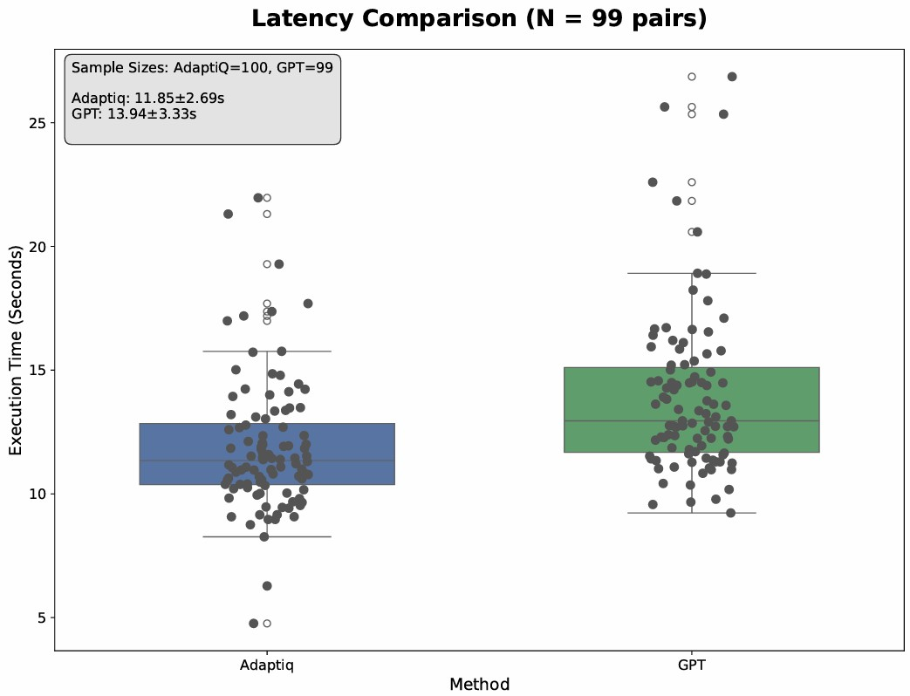
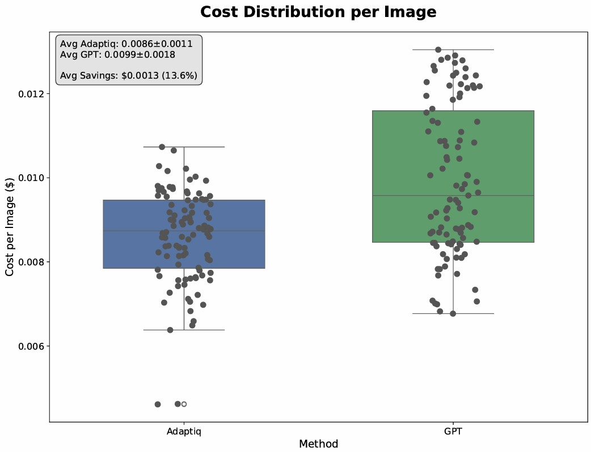
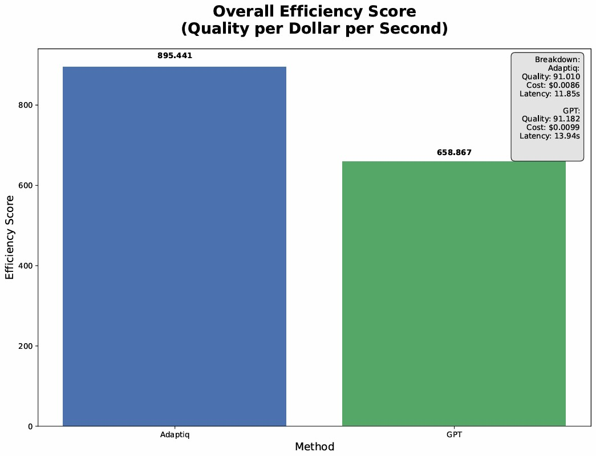

# AdaptiQ Image Generation Agent Benchmark

A comprehensive benchmark for evaluating and optimizing image generation agents using reinforcement learning and adaptive optimization techniques.

## Overview

The AdaptiQ Image Generation Agent Benchmark is part of the [AdaptiQ framework](https://github.com/AdaptiQ-ai/AdaptiQ) - an adaptive optimization system that uses reinforcement learning to improve AI agent performance while reducing costs. This benchmark specifically focuses on evaluating image generation agents across various metrics including quality, prompt adherence, efficiency, and resource utilization.

## Quick Start

### Prerequisites

- Python 3.11+
- Credits required to run the test (~$8 minimum)
- Required dependencies (see `requirements.txt`)

### Installation

First, install `uv` if you haven't already:

```bash
# On macOS and Linux
curl -LsSf https://astral.sh/uv/install.sh | sh

# On Windows
powershell -c "irm https://astral.sh/uv/install.ps1 | iex"

# Alternative: Install via pip
pip install uv
```

Clone the repository and set up the environment:

```bash
git clone https://github.com/AdaptiQ-ai/AdaptiQ-benchmark.git
cd image_gen_agent
```

Create and activate virtual environment using `uv`:

```bash
uv venv
source .venv/bin/activate  # On Windows: .venv\Scripts\activate
uv pip install -r requirements.txt
```

### Configuration

Set your API keys in the `.env` file:

```env
OPENAI_API_KEY=your-openai-key
GOOGLE_API_KEY=your-google-ai-key  
REPLICATE_API_KEY=your-replicate-key
```

### Running the Tests

Run the benchmark test:

```bash
python flow_test.py
```

Generate PDF report:

```bash
python generate_report.py
```

### Additional Information

- **Prompts Configuration**: Inspect the prompts used in `./config/prompts.json`
- **Test Images**: Original images for testing are located in `./images` with all sources from Pinterest
- **Example Test Run**: See an example of a complete test run in `./test_results/20250813_100138`

## Benchmark Design & Reproducibility

### Task
Given a target synthetic image, each agent must reproduce it with maximum fidelity at minimum cost.

### Paired Design
Each target is processed by two agents:
- **Baseline:** CrewAI + GPT-4.1 reasoning → FLUX-1.1-pro image
- **AdaptiQ:** Same stack + AdaptiQ runtime RL (context-ops)

### Model IDs (Pinned)
- **Reasoning:** `openai:gpt-4.1`
- **Image:** `replicate:bl-fx/flux-1.1-pro`

### Measurement Metrics
- **Latency:** Wall-clock per agent's run
- **Cost:** Provider unit prices × usage, currency = USD
- **Tokens:** Prompt + completion tokens
- **Quality (CLIP):** `ViT-B/32`

## AdaptiQ Runtime RL Architecture

### 🧩 State (s)
Represents the agent's situation at a specific step, defined by features like:
- **Current_SubTask:** The immediate objective
- **Last_Action_Taken:** The previous validated ARIC strategic action
- **Last_Outcome:** The validated result of the previous action
- **Key_Context:** Accumulated relevant information (validated flags/data)

### 🎯 Action (a)
A selection from a predefined menu of discrete, strategic actions (e.g., Use_Tool_X, Action_Write_Content). AdaptiQ maps observed log events to these predefined actions.

### 📊 Q-Table
The core knowledge base: `Q(state_representation, action) → value`. It stores the learned long-term value of taking an action in a specific state, refined through the AdaptiQ loop.

### 🏆 Reward (R)
Calculated offline during/after trace reconciliation, guided by predefined rules. It incorporates:
- **Plan Adherence:** How well the actual execution matched the intended plan from prompt parsing
- **Execution Success (R_execution/internal):** Based on tool outcomes, task progress, constraint adherence, and output quality from the logs

### Update Formula (Tabular Q-learning)
```
Q(s,a) ← Q(s,a) + α[R + γ max Q(s',a') - Q(s,a)]
```

## Results (Snapshot)

| Metric | Baseline | AdaptiQ | Δ (%) | p-value |
|-------:|---------:|--------:|------:|:-------:|
| Latency (s) | 13.94 | 11.85 | −15.0% | < 0.001 |
| Cost (USD/img) | 0.0099 | 0.0086 | −13.6% | < 0.001 |
| Tokens (count) | 8347 | 7459 | −10.6% | 0.366 (ns) |
| Quality (CLIP) | 91.18 | 91.01 | **ΔCLIP = −0.17** | target ≥ 0 |

### Performance Analysis

#### Latency Comparison


AdaptiQ generates results significantly faster, averaging 2.09 seconds less per task than GPT. This 15% speed boost means faster turnaround and better scalability in production environments.

#### Cost Distribution per Image


On average, AdaptiQ reduces generation costs by 13.6% per image.

#### Overall Efficiency Score


When combining quality, speed, and cost, AdaptiQ achieves an Efficiency Score of 895.44, outperforming GPT's 658.87 by a wide margin. This metric reflects its balanced performance advantage in real-world workloads.

**Takeaway:** Cheaper & faster at near-parity quality; ΔCLIP target is ≥ 0; current snapshot shows −0.17.

## Stability (Variance Control)

AdaptiQ reduces dispersion of token usage:
- **StdDev(tokens):** Baseline ≈ 1278 vs AdaptiQ ≈ 457 → **2.8× lower variance**
- Mean difference is NS (p = 0.366), but lower variance enables **masterable agent policy** and **context stability**

## Data & Licensing

Test targets are sourced from Pinterest (research use). Original links in `./images/{category}/sources.txt`.

**Usage:** Evaluation/research only; do not redistribute outside this repo.

### License
- **Code:** Apache-2.0 License
- **Data:** Research use only (Pinterest sources)

---

*Part of the AdaptiQ ecosystem for adaptive AI agent optimization*
